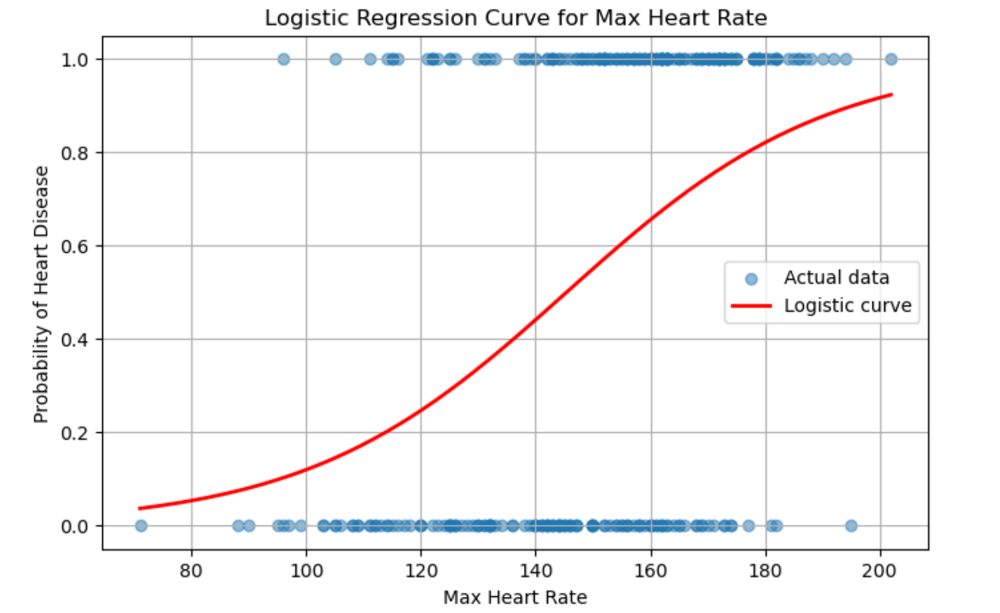

# Heart Disease Prediction using Logistic Regression

This repository contains a machine learning project for predicting the presence of heart disease in patients based on a set of medical attributes. The analysis is performed using a Logistic Regression model implemented in a Jupyter Notebook.

---

## 📂 Repository Files

-   `Heart_Disease_Detector.ipynb`: The main Jupyter Notebook containing the Python code for data analysis, model training, and prediction.
-   `heart_disease_data.csv`: The dataset used for training and testing the model.
-   `Heart_Disease_ML_Analysis_Summary.pdf`: A summary document outlining the project, key findings, and model performance.
-   `curve.png`: A curve outlining the logistic regression model used in this analysis.
-   `README.md`: This file, providing an overview of the repository.

---

## 📖 Project Overview

This project aims to build a predictive model to determine whether a person has heart disease. The model is trained on the "Heart Disease UCI" dataset. The notebook covers all the essential steps of a machine learning workflow:

1.  **Data Loading and Exploration**: Importing the dataset and understanding its structure.
2.  **Exploratory Data Analysis (EDA)**: Visualizing the data to uncover trends, patterns, and correlations between different medical attributes.
3.  **Data Preprocessing**: Preparing the data for the machine learning model.
4.  **Model Training**: Splitting the data into training and testing sets and training a Logistic Regression model.
5.  **Model Evaluation**: Assessing the model's performance using accuracy as the primary metric.
6.  **Predictive System**: Building a simple system to predict heart disease for a new set of input data.

---

## 📊 Dataset

The dataset used is `heart_disease_data.csv`, which contains 303 entries and 14 columns (features). The `target` column is the variable we aim to predict:
* `1`: The patient has heart disease.
* `0`: The patient does not have heart disease.

### Key Features
* `age`: Age of the patient
* `sex`: (1 = male; 0 = female)
* `cp`: Chest pain type
* `trestbps`: Resting blood pressure
* `chol`: Serum cholestoral in mg/dl
* `thalach`: Maximum heart rate achieved
* `exang`: Exercise induced angina

---

## 🚀 How to Use

To run this project, you need to have Python and the following libraries installed:

* pandas
* numpy
* scikit-learn
* matplotlib
* seaborn

You can install these libraries using pip:
```bash
pip install pandas numpy scikit-learn matplotlib seaborn
```

After installing the dependencies, you can run the `Heart_Disease_Detector.ipynb` notebook using Jupyter Notebook or JupyterLab.

---

## 📈 Results and Performance

The Logistic Regression model was trained on 80% of the data and tested on the remaining 20%. The model achieved an **accuracy of 85.25%** on the test set.


*Figure: Model performance curve (accuracy/loss over epochs)*

---

## 📄 Report

A concise, stakeholder-friendly summary of the findings and recommendations is available in the PDF:

> **[📥 Heart_Disease_ML_Analysis_Summary.pdf](Heart_Disease_ML_Analysis_Summary.pdf)**

---

### Key Insights from EDA:
* The dataset is fairly balanced, with 165 cases of heart disease and 138 healthy cases.
* Features like chest pain type (`cp`), maximum heart rate (`thalach`), and exercise-induced angina (`exang`) show a strong correlation with the presence of heart disease.
* The heatmap visualization of feature correlations provided a clear overview of the most influential factors.

**Note:** This model is for educational purposes and not intended for medical diagnosis.

---

## 📊 Dataset Link

The dataset used for this project can be found at the following link:
[Heart Disease Prediction Dataset](https://github.com/ChitranjanUpadhayay/ML_Projects/tree/main/Datasets/Heart%20Disease%20Prediction)

---

## ✍️ Author

This project was created to demonstrate a fundamental machine learning classification task.
